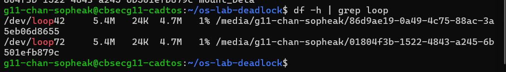
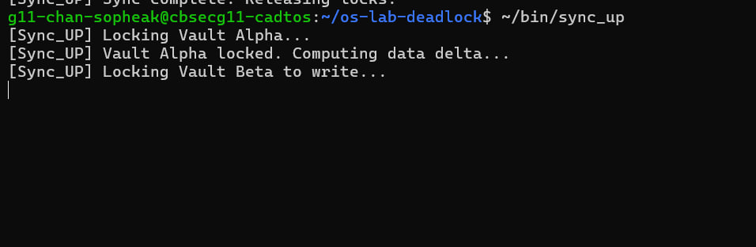
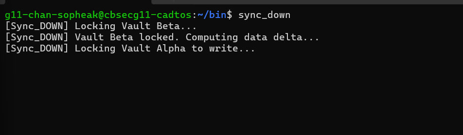
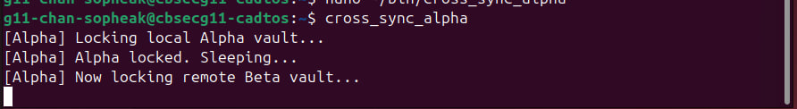
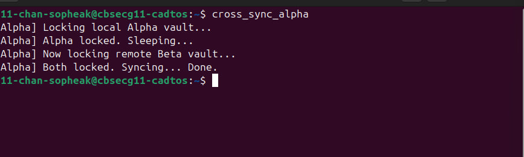
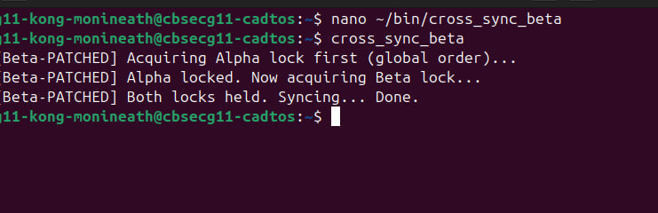
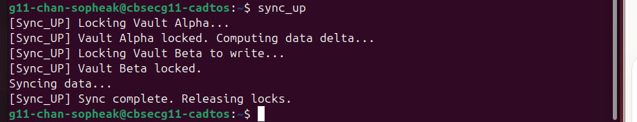
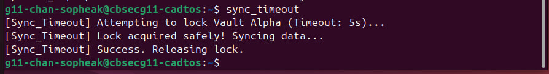

# OS Lab: The Quantum Vault Deadlock
**Student:** Chan Sopheak  
**Student ID:** IDTB110320  
**Partner:** Kong Monineath  
**Date:** April 2026  

---

## Overview

This lab explores core operating system concepts including virtual file system mounting, process synchronization using file locks, deadlock creation and detection, and deadlock prevention and recovery strategies. We provision two virtual encrypted vaults, intentionally trigger deadlocks both locally and across user accounts, then patch the system using Resource Ordering and Timeout Recovery techniques.

---

## Level 1: Virtual Vault Provisioning

### What We Did
Created two 10MB virtual disk image files (`vault_alpha.img` and `vault_beta.img`) using `dd`, formatted them as ext4 file systems using `mkfs.ext4`, attached them to loopback devices using `udisksctl loop-setup`, mounted them using `udisksctl mount`, and created symlinks inside `~/os-lab-deadlock` for clean script access.

### Commands Used
```bash
dd if=/dev/zero of=vault_alpha.img bs=1M count=10
dd if=/dev/zero of=vault_beta.img bs=1M count=10
mkfs.ext4 -F vault_alpha.img
mkfs.ext4 -F vault_beta.img
udisksctl loop-setup -f vault_alpha.img
udisksctl loop-setup -f vault_beta.img
udisksctl mount -b /dev/loopX
udisksctl mount -b /dev/loopY
ln -s /run/media/g11-chan-sopheak/<alpha-uuid> mount_alpha
ln -s /run/media/g11-chan-sopheak/<beta-uuid> mount_beta
```

### Observation Checkpoint 1 — Screenshot


**Explanation:** The `df -h | grep loop` output confirms that both loopback devices are successfully mounted and recognized by the kernel's Virtual File System. Each virtual drive consumes approximately 10MB of space, proving the ext4 file systems were created and attached correctly without requiring root privileges.

---

## Level 2: The Naive Sync Scripts

### What We Did
Created two bash scripts — `sync_up` and `sync_down` — that simulate a bi-directional data sync between the two vaults. Each script acquires locks on both vaults but in **opposite orders**, which is the root cause of the deadlock in Level 3.

- `sync_up` locks **Alpha first**, then **Beta**
- `sync_down` locks **Beta first**, then **Alpha**

---

## Level 3: The Local Circular Wait (Deadlock)

### What We Did
Ran `sync_up` in Terminal 1 and `sync_down` in Terminal 2 simultaneously. Both scripts hung indefinitely and never printed "Sync complete."

### Why the Deadlock Occurred
This is a classic **Circular Wait** — one of the four necessary conditions for deadlock:

| Script | Holds | Waiting For |
|--------|-------|-------------|
| `sync_up` | Alpha lock (fd 200) | Beta lock (fd 201) |
| `sync_down` | Beta lock (fd 201) | Alpha lock (fd 200) |

`sync_up` locked Vault Alpha and then waited for Vault Beta. At the same time, `sync_down` locked Vault Beta and waited for Vault Alpha. Neither script would release its held lock until it acquired the second one — creating an infinite circular dependency. The system froze permanently until manually interrupted with `Ctrl+C`.

### Observation Checkpoint 2 — Screenshot



---

## Level 4: Site-to-Site Sync (Multiplayer Deadlock)

### What We Did
Paired with classmate **Kong Monineath** (g11-kong-monineath). I acted as **Player A (Alpha Site)** and my partner acted as **Player B (Beta Site)**. We set up public DMZ directories with open permissions so each user's script could lock the other's vault file across user accounts.

- My script (`cross_sync_alpha`) locked my local `public_dr_alpha/vault.lock`, slept 2 seconds, then attempted to lock my partner's `public_dr_beta/vault.lock`
- Partner's script (`cross_sync_beta`) locked their local `public_dr_beta/vault.lock`, slept 2 seconds, then attempted to lock my `public_dr_alpha/vault.lock`

Both scripts ran simultaneously — and both froze.

### How This Simulates a Distributed Denial of Service
This simulates a **distributed deadlock** where two separate services on a network each hold a resource the other needs. In a real production environment, this would cause both services to become completely unresponsive — effectively a self-inflicted denial of service. No external attacker is needed; the flawed synchronization logic causes the entire system to freeze, making it unavailable to all users.

### Observation Checkpoint 3 — Screenshot



---

## Level 5: Global Resource Ordering (The Patch)

### What We Did
Agreed on a **global lock order**: Alpha's lock must **always** be acquired before Beta's lock, regardless of which direction the data flows.

- My `cross_sync_alpha` was already correct (Alpha → Beta order)
- Partner rewrote `cross_sync_beta` to acquire Alpha's lock **first**, even though it is syncing from Beta to Alpha

### Why This Fixes the Deadlock
By enforcing a strict global ordering, we eliminated the **Circular Wait** condition. Now both processes compete for Alpha's lock first. One will win and hold it, while the other safely waits. The winner then acquires Beta's lock, completes the sync, and releases both locks. Only then does the waiting process proceed — no circular dependency, no freeze.

### Observation Checkpoint 4 — Screenshot



---

## Level 6: Deadlock Recovery (Timeout Patch)

### What We Did
Created a new script `sync_timeout` that uses `flock -w 5` to wait a **maximum of 5 seconds** for the Alpha lock. If the lock cannot be acquired within that window, the script prints an error and exits cleanly instead of hanging forever.

### Test Procedure
- Terminal 1: ran `sync_up` (holds Alpha lock for 3+ seconds)
- Terminal 2: immediately ran `sync_timeout`
- Result: Terminal 2 waited 5 seconds, detected it could not acquire the lock, and printed the timeout error — then exited cleanly

### Why Timeouts Are Useful for Server Health
In production systems, processes that hang indefinitely consume memory, file descriptors, and CPU scheduling slots. Over time, accumulated frozen processes can exhaust server resources. The timeout strategy implements **Deadlock Recovery via Preemption** — the process voluntarily aborts and releases its held resources, keeping the server healthy and allowing other processes to continue. It trades a failed sync attempt for overall system availability.

### Observation Checkpoint 5 — Screenshot



---

## Level 7: Safe Ejection (Teardown)

### What We Did
Created a `teardown` script that safely unmounts both virtual vaults, detaches the loopback devices from the kernel, and removes the symlinks — in the correct order to prevent file system corruption.

### Why Proper Teardown Is Critical
Forcibly deleting a mounted `.img` file or killing the process without unmounting leaves **orphaned loopback devices** in the kernel (`/dev/loopX` entries that still exist but point to nothing). These orphaned devices persist until reboot and consume slots from the kernel's limited pool of available loop devices. On a shared server like ours — where every student is using loop devices — exhausting this pool would prevent any user from mounting new virtual drives. Proper teardown also ensures all pending write buffers are flushed to the image file, preventing data corruption.

### Observation Checkpoint 6 — Screenshot


---

## Summary of Deadlock Conditions

| Condition | Present in Level 3? | How It Was Broken |
|-----------|--------------------|--------------------|
| Mutual Exclusion | Yes — `flock -x` ensures only one holder | Not broken (necessary for data safety) |
| Hold and Wait | Yes — each script held one lock while waiting | Not broken directly |
| No Preemption | Yes — locks not forcibly taken | **Broken in Level 6** via `flock -w` timeout |
| Circular Wait | Yes — A waits for B, B waits for A | **Broken in Level 5** via Resource Ordering |

---

## File Structure

```
~/
├── bin/
│   ├── cross_sync_alpha
│   ├── sync_down
│   ├── sync_timeout
│   ├── sync_up
│   └── teardown
│
└── os-lab-deadlock/
    ├── public_dr_alpha/
    │   └── vault.lock
    ├── mount_alpha          (symlink - local only)
    ├── mount_beta           (symlink - local only)
    ├── vault_alpha.img
    ├── vault_beta.img
    └── README.md
```